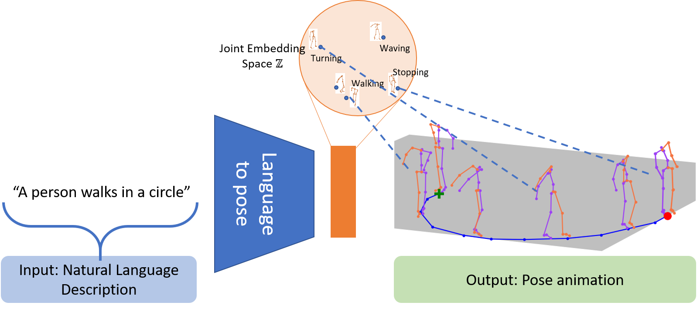

    
        
    

    
	Abstract
	

Generating animations from natural language sentences finds its applications in a a number of domains such as movie script visualization, virtual human animation and, robot motion planning. These sentences can describe different kinds of actions, speeds and direction of these actions, and possibly a target destination. The core modeling challenge in this language-to-pose application is how to map linguistic concepts to motion animations. In this paper, we address this multimodal problem by introducing a neural architecture called \model (or \modelshort), which learns a joint embedding of language and pose. This joint embedding space is learned end-to-end using a curriculum learning approach which emphasizes shorter and easier sequences first before moving to longer and harder ones. We evaluate our proposed model on a publicly available corpus of 3D pose data and human-annotated sentences. Both objective metrics and human judgment evaluation confirm that our proposed approach is able to generate more accurate animations and are deemed visually more representative by humans than other data driven approaches.	

    
        <a href="https://arxiv.org/abs/1907.01108">[Paper]</a>
        <a href="https://github.com/chahuja/language2pose">[Code]</a>
    

Demo
 
<iframe width="640" height="360" src="https://www.youtube.com/embed/zfllpcBlAVI" frameborder="0" allow="accelerometer; autoplay; encrypted-media; gyroscope; picture-in-picture" allowfullscreen></iframe>

    
        Media Coverage
         
        
        
    

    
	Acknowledgments
	

This material is based upon work partially supported by the National Science Foundation (Award \#1750439). Any opinions, findings, and conclusions or recommendations expressed in this material are those of the author(s) and do not necessarily reflect the views of National Science Foundation, and no official endorsement should be inferred.
